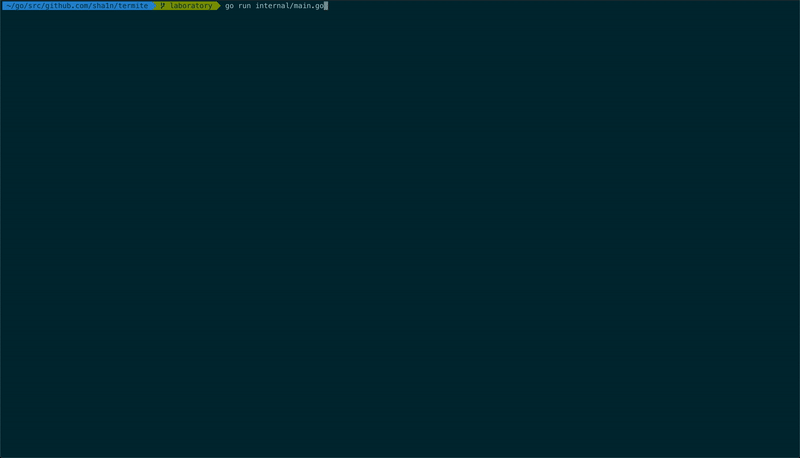

[](https://github.com/sha1n/termite/actions/workflows/go.yml)
[](https://pkg.go.dev/github.com/sha1n/termite)

[](https://goreportcard.com/report/github.com/sha1n/termite)
[](https://coveralls.io/github/sha1n/termite?branch=master)
[](https://github.com/sha1n/termite/releases)
[](https://opensource.org/licenses/MIT)
[](https://github.com/sha1n/termite/actions/workflows/go-report-card.yml)
[](https://github.com/sha1n/termite/actions/workflows/release-drafter.yml)


- [TERMite](#termite)
  - [Install](#install)
  - [Examples](#examples)
    - [Spinner](#spinner)
    - [Progress Bar](#progress-bar)
    - [Matrix](#matrix)
  - [Showcase](#showcase)

# TERMite
Termite is my playground for terminal app utilities and visual elements such as progress bars and indicators, cursor control and screen updates.

## Install
```bash
go get github.com/sha1n/termite
```

## Examples
### Spinner
```go
ctx, cancel := context.WithCancel(context.Background())
defer cancel()

refreshInterval := time.Millisecond * 100
spinner := termite.NewSpinner(termite.StdoutWriter, "Processing...", refreshInterval, termite.DefaultSpinnerFormatter())

if err := spinner.Start(ctx); err == nil {
  doWork()
  
  _ = spinner.Stop(context.Background(), "Done!")
}

// Or using the fluent builder
builder := termite.NewSpinnerBuilder().
	WithTitle("Processing...").
	WithInterval(time.Millisecond * 100)

spinner := builder.Build()
_ = spinner.Start(ctx)
```

### Progress Bar
```go
ctx, cancel := context.WithCancel(context.Background())
defer cancel()

termWidthFn := func() int { w, _, _ := termite.GetTerminalDimensions(); return w }
progressBar := termite.NewProgressBar(termite.StdoutWriter, tickCount, termWidthFn, width, termite.DefaultProgressBarFormatter())

if tick, err := progressBar.Start(ctx); err == nil {
  doWork(tick)
}
```

### Matrix
```go
ctx, cancel := context.WithCancel(context.Background())
defer cancel()

refreshInterval := time.Millisecond * 100
matrix := termite.NewMatrix(termite.StdoutWriter, refreshInterval)
done := matrix.Start(ctx)

// Allocate rows for concurrent tasks
rows := matrix.NewRange(3)
for i, row := range rows {
  go func(idx int, r termite.MatrixRow) {
    r.Update(fmt.Sprintf("Task %d: Running...", idx+1))
    doWork()
    r.Update(fmt.Sprintf("Task %d: Done!", idx+1))
  }(i, row)
}

// Wait for completion
cancel()
<-done
```

## Showcase
The code for this demo can be found in [cmd/demo/main.go](https://github.com/sha1n/termite/blob/master/cmd/demo/main.go) (`go run -mod=readonly ./cmd/demo`). 



